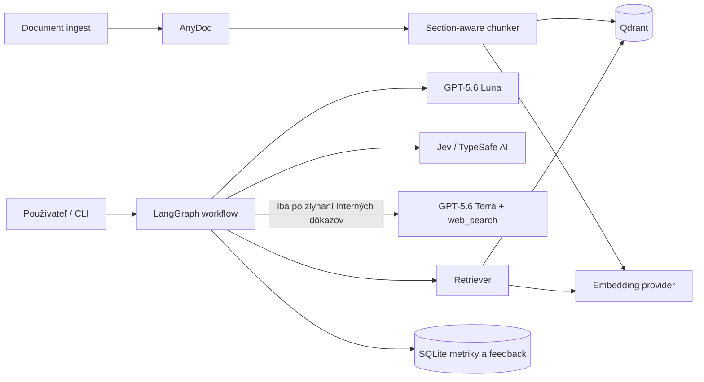

# DOC·AI — citáciami podložený dokumentový asistent

Terminálová Python aplikácia odpovedá z viacerých dokumentov, ku každej odpovedi
prikladá zdroje, pri nedostatku dôkazov skúsi doplňujúci retrieval a voliteľne web.
Ak ani potom nevie odpoveď podložiť, radšej sa odpovede zdrží.

## Čo riešenie obsahuje

- import PDF, DOC/DOCX, PPT/PPTX, XLS/XLSX, ODT/ODS/ODP, RTF, EPUB a CSV cez AnyDoc,
- fyzické čísla strán pre PDF; pri reflowable formátoch logickú stranu,
- sekčne orientované chunkovanie a rekurzívne delenie na približne 1 400 znakov,
- Qdrant s `k=5` a metadátami dokumentu, strany, sekcie, tenantu a chunku,
- OpenAI `text-embedding-3-large` alebo lokálne `multilingual-e5-large`,
- OpenAI GPT-5.6 Luna (`gpt-5.6-luna`) pre návrh odpovede a query rewrite,
- Jev cez TypeSafe AI pre overenie citovaných tvrdení a úplnosti odpovede,
- OpenAI GPT-5.6 Terra s natívnym `web_search` pre webový fallback,
- LangGraph workflow s pevnou hranicou retrievalu a bezpečnou abstenciou,
- zdieľaný semafor API volaní s dvoma retry po 10 a 60 sekundách,
- Rich chatové CLI, interaktívne mazanie dokumentov a prevádzkové metriky,
- deterministické unit testy bez platených API volaní.

## Rýchly štart

Odporúčaný je Python 3.11–3.13; projekt povoľuje aj 3.14, ak sú pre platformu
dostupné všetky binárne balíky.

```bash
python -m venv .venv
source .venv/bin/activate
pip install -e ".[dev]"
cp .env.example .env
# doplňte OPENAI_API_KEY a TYPESAFE_API_KEY
doc-assistant
```

Lokálne embeddingy:

```bash
pip install -e ".[dev,local-embeddings]"
# v .env nastavte EMBEDDING_PROVIDER=local
```

## CLI príkazy

| Príkaz | Význam |
|---|---|
| `/add CESTA` | skopíruje dokument do `files/`, spracuje ho a vloží vektory |
| `/files` | zobrazí dokumenty, umožní výber a bezpečné zmazanie |
| `/delete ID` | odstráni súbor, manifest aj všetky jeho body z Qdrantu |
| `/sources` | zobrazí zdroje poslednej odpovede |
| `/good [poznámka]` | uloží pozitívny feedback |
| `/bad [poznámka]` | zaradí interakciu na kontrolu |
| `/metrics` | zobrazí latenciu, tokeny, abstencie a feedback |
| `/status` | zobrazí modely a aktívne nastavenia |
| `/clear` | vyčistí terminál |
| `/help` | zobrazí pomoc |
| `/exit` | ukončí chatovací loop |

Otázka bez lomky sa po stlačení Enter odošle workflowu.

## Architektúra



Podrobné komponenty, sekvenčný, stavový a deployment diagram sú v
[docs/ARCHITECTURE.md](docs/ARCHITECTURE.md).

## Rozhodovací tok

1. Otázka sa embedduje a z Qdrantu sa načíta päť najbližších chunkov.
2. Chunky pod minimálnym skóre sa odstránia.
3. GPT-5.6 Luna vytvorí odpoveď a najviac šesť atómových tvrdení s citovanými `chunk_id`.
4. Jev posúdi vzťah každej citácie k tvrdeniu, úplnosť zoznamu tvrdení,
   dostatočnosť a relevanciu. Chýbajúce alebo neplatné citácie sa odmietnu bez API volania.
5. Aplikácia vypočíta confidence z retrieval skóre a verifikačných metrík.
6. Ak gate neprejde, model vytvorí jeden doplňujúci query a retrieval sa zopakuje.
7. Po vyčerpaní interných pokusov nasleduje voliteľný webový fallback.
8. Bez citácií alebo pod prahom istoty sa systém odpovede zdrží.

Jev overuje iba dokumentovú vetvu. Webový fallback dnes vyžaduje URL citácie,
ale jeho tvrdenia neprechádzajú Jev kontrolou; pri citlivých použitiach ho vypnite.

Confidence nie je modelom deklarované percento. Aktuálny vzorec je:

```text
0.25 × retrieval + 0.35 × faithfulness
+ 0.20 × answer relevance + 0.20 × citation coverage
```

Pred produkciou treba váhy, `MIN_ANSWER_CONFIDENCE=0.72` a
`MIN_JEV_CONFIDENCE=0.80` kalibrovať na doménovom validačnom datasete,
osobitne pre slovenské otázky.

## Spracovanie dokumentov

Ako primárny parser bol zvolený **AnyDoc**:

- pokrýva všetky požadované kancelárske formáty jedným dokumentovým modelom,
- lokálne zachováva nadpisy, tabuľky, zoznamy a poznámky v Markdowne,
- uvoľňuje GIL a má pevné resource limity,
- pri skenovanom PDF explicitne vyhodí `NeedsOcrError`.

Pre PDF sa každá strana konvertuje samostatne, aby mal každý chunk presnú stránku.
Pri `OCR_MODE=hosted` sa skenované strany odošlú Firecrawl Parse. Default
`OCR_MODE=reject` nič neposiela mimo počítača. OCRmyPDF je vhodný doplnkový lokálny
preprocessing pre organizácie, ktoré nesmú dokumenty odoslať; olmOCR dáva vysokú
kvalitu komplexných vedeckých PDF, ale vyžaduje podstatne ťažší GPU deployment.

Nadpisy Markdownu tvoria prirodzené sekcie. Ak dokument obsahuje obsah a nadpisovú
štruktúru, chunky si uchovávajú názov sekcie. Sekcie dlhšie než limit sa delia
rekurzívne cez `\n\n`, `\n`, vetu a medzeru s overlapom 180 znakov.

## Zdroje a konzistencia

Každý vektor nesie:

```json
{
  "document_id": "uuid",
  "filename": "zmluva.pdf",
  "page_start": 12,
  "page_end": 12,
  "section": "Zodpovednosť",
  "chunk_id": "Qdrant point UUID",
  "tenant_id": "local"
}
```

Import používa kompenzačný rollback. Pri chybe Qdrantu sa skopírovaný súbor
odstráni; pri chybe manifestu sa odstránia aj vložené vektory. Mazanie filtruje
súčasne podľa `document_id` a `tenant_id`.

## Konfigurácia modelov

Názvy sú v `.env`, aby sa model dal vymeniť bez zmeny workflowu. Oficiálna
[OpenAI dokumentácia GPT-5.6 Luna](https://developers.openai.com/api/docs/models/gpt-5.6-luna)
uvádza ID `gpt-5.6-luna` a podporu Chat Completions. Nastavenie
`OPENAI_ANSWER_MODEL` riadi generátor, `OPENAI_WEB_MODEL` webový fallback;
pre oba sa používa `OPENAI_API_KEY`. Dokumentácia
[`text-embedding-3-large`](https://developers.openai.com/api/docs/models/text-embedding-3-large)
ho uvádza ako najschopnejší embedding model pre angličtinu aj iné jazyky.
[TypeSafe dokumentácia](https://docs.typesafe.ai/sdk/python) opisuje Python SDK;
aplikácia používa pripnuté ID `jev-1.13.0` cez `TYPESAFE_MODEL`.

GPT-5.6 Luna používa nízke reasoning effort a JSON režim; pri migrácii sa
neposiela pôvodný parameter `temperature=0`. Volania OpenAI aj TypeSafe
prechádzajú zdieľaným semaforom. Pri
dočasnom rate limite, serverovej chybe alebo výpadku spojenia nasledujú nanajvýš
dve opakovania po 10 a 60 sekundách (prípadne dlhšie podľa `Retry-After`).
Trvalo vyčerpaný kredit alebo kvóta sa neopakujú. Interné retry SDK sú vypnuté,
aby nevznikali skryté pokusy navyše.

Pri zmene embedding modelu použite novú Qdrant collection alebo vykonajte úplný
reindex. Vektory s rôznou dimenziou ani geometriou sa nesmú miešať.

## Testy

```bash
pytest
pytest --cov=doc_assistant --cov-report=term-missing
ruff check .
```

Stratégia kvality, benchmarky a ablačné experimenty sú v
[docs/EVALUATION.md](docs/EVALUATION.md). Bezpečnosť a RBAC sú v
[docs/SECURITY.md](docs/SECURITY.md).

## Produkčné upozornenia

Embedded Qdrant je vhodný pre lokálnu CLI aplikáciu. Multi-user produkcia má použiť
Qdrant server s TLS, autentifikáciou, snapshotmi a samostatnými collection/tenant
filtrami. SQLite metriky nahraďte OpenTelemetry + Prometheus/Grafana a citlivé
prompty neposielajte do logov. API kľúče patria do secret managera, nikdy do Gitu.
