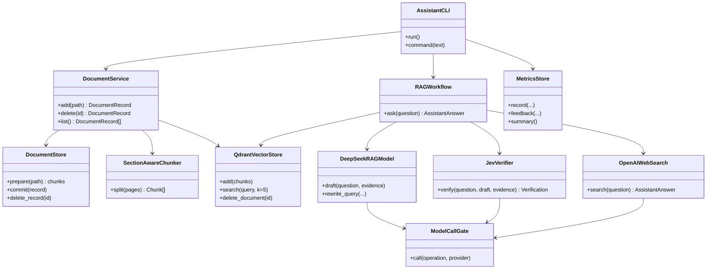
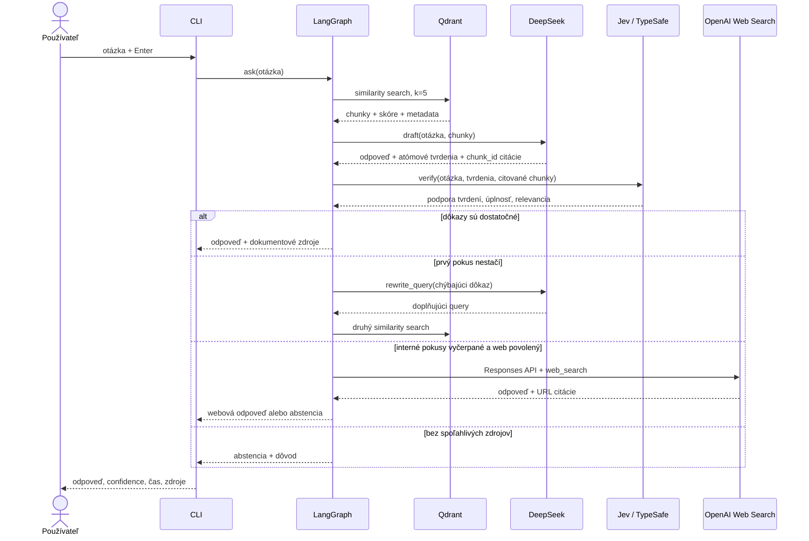
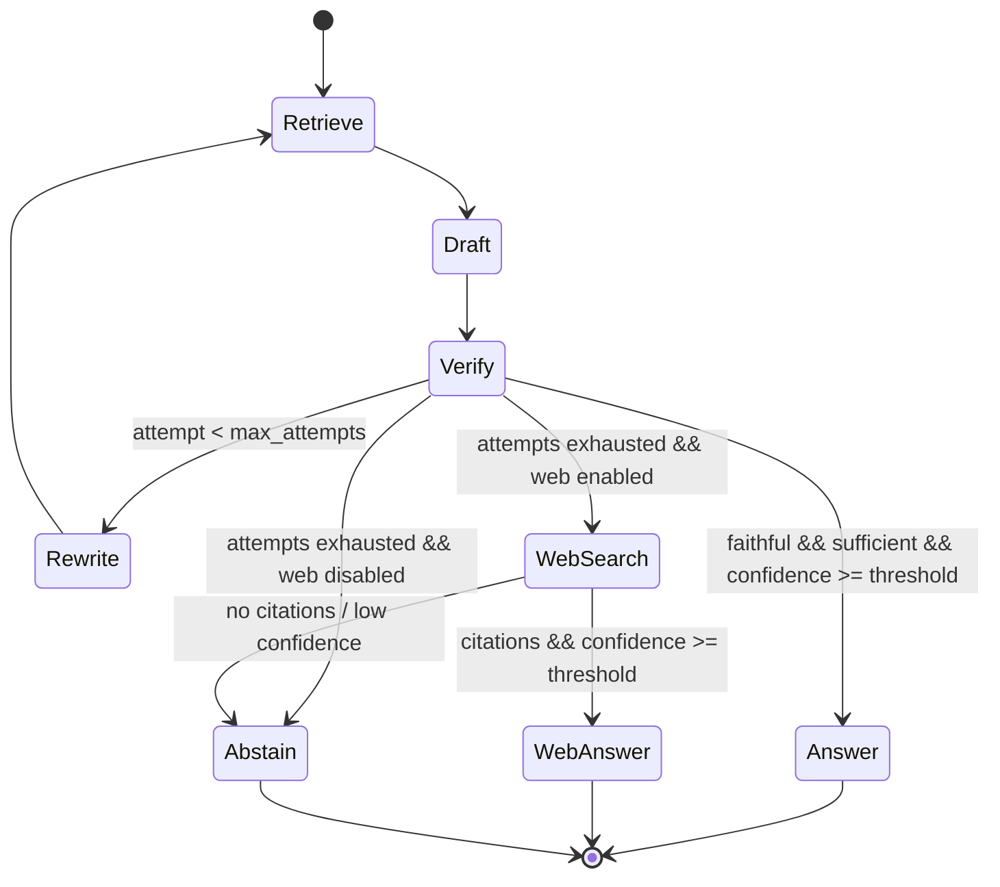
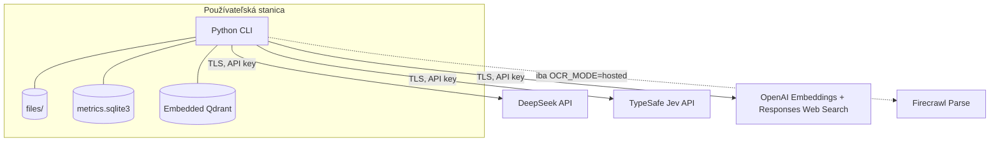

# Architektúra riešenia

## Ciele a hranice

Systém je navrhnutý ako lokálna CLI aplikácia s jasnými portmi pre dokumentové
úložisko, vektory, embeddingy, LLM a web. Jadro nepozná konkrétny UI framework.
To umožňuje neskôr doplniť REST API alebo webové UI bez zmeny rozhodovacieho grafu.

## UML komponentový diagram

## UML sekvenčný diagram odpovede

## UML stavový diagram

## UML deployment diagram

## Externé systémy a API

Provider adaptéry sú na okraji systému. DeepSeek používa OpenAI-compatible Chat
Completions s JSON režimom. Jev používa TypeSafe Python SDK: pre každé tvrdenie
vracia typovanú voľbu `supports`/`contradicts`/`says_nothing` a pre dostatočnosť,
relevanciu a úplnosť numerické odpovede. Jev neposkytuje finálny text odpovede.
OpenAI web používa Responses API s explicitným nástrojom
`{"type":"web_search"}` a zbiera URL anotácie. Embedding adapter možno vymeniť za
lokálny SentenceTransformer.

Jeden `ModelCallGate` obmedzuje súbežnosť volaní modelových API na 1. Retry
schéma je 10 s, potom 60 s; čakanie prebieha mimo semafora. Rešpektuje sa dlhší
`Retry-After`. Trvalé chyby kreditu/kvóty sa neopakujú a interné retry SDK sú
vypnuté. Po poslednej chybe sa výnimka propaguje do CLI; nie je to verifikovaná
odpoveď ani tichá abstencia.

Jev kontroluje dokumentovú vetvu. Webový fallback má URL citácie, ale bez
obsahu webových stránok nevykonáva claim-level kontrolu Jev. Pre citlivé nasadenie
treba web vypnúť alebo doplniť načítanie a overenie citovaných stránok.

Pre budúce podnikové API treba pridať samostatný, úzko typovaný tool adapter:

1. pevné meno operácie, napr. `get_invoice_status`,
2. JSON Schema vstupu a výstupu,
3. pevný hostname a metódu; žiadna modelom zadaná URL,
4. tenant/user authorization pred volaním,
5. timeout, retry iba pre idempotentné operácie a circuit breaker,
6. audit event bez tajomstiev a citlivého payloadu,
7. výsledok zaradiť medzi dôkazy a znovu overiť.

Zápisové operácie musia mať human confirmation a idempotency key. Aktuálna verzia
vykonáva iba čítacie externé volania.

## Kľúčové návrhové rozhodnutia

- **LangGraph namiesto voľného agenta:** povolené prechody, retry a náklady sú
  deterministické.
- **Oddelený generator a verifier:** DeepSeek navrhuje odpoveď, Jev nezávisle
  klasifikuje citované tvrdenia a dostatočnosť dôkazov.
- **Citácie cez ID:** model neprodukuje názov súboru ani stranu; iba vyberá ID a
  aplikácia z neho vytvorí referenciu.
- **Tenant filter pri každom čítaní a mazaní:** ochrana nesmie existovať iba v UI.
- **Abstencia je úspešný výsledok:** nejde o exception ani neúspech aplikácie.
